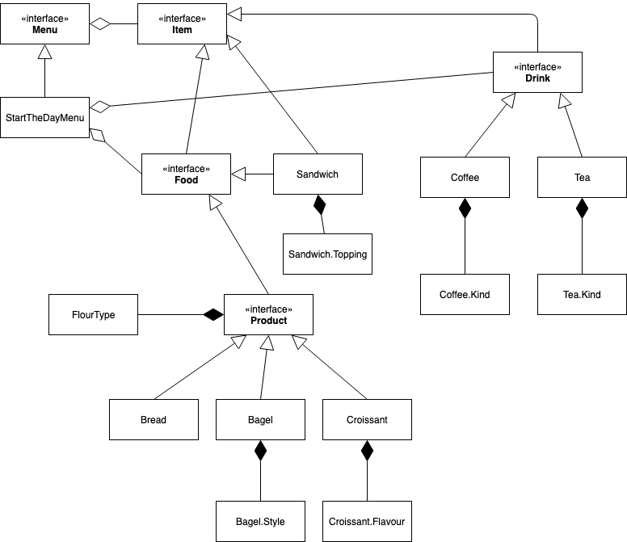

# Swinject workshop

## DI and terminology

Swinject documentation has a quite good start on this. [Link](https://github.com/Swinject/Swinject/blob/master/Documentation/DIContainer.md#di-container)

## Basic registrations - 0

_Let's say we are creating an app for a bakery store. Silly I know, but for this workshop we will stick to this example. This bakery sells it's own products, some sandwiches made of these and hot drinks. They even have menus just to encourage people to come in the morning and have a breakfast for example._

Talk about registration keys: 
	Key(type, name, argument number AND type) --> so two arguments with different types swithced is good to go
	
Argument types should be exactly the same as in the registration. No superclasses or optionals or implementation/interface exchanges.

## InjectionPatterns - 1

### Initializer injection - 1.1

The previous example with sandwich was this.

### Property injection - 1.2

Ok, if the dependency is optional to the dependent, or if the architecture doesn't permits us to inject through init (UIViewControllers?).

### Method injection - 1.3

Most of the time we would like to avoid this, as methods should be more like interactions or request towards the objects. Passing dependencies in methods hides the importance of that dependency. That said we might end up in situations (3rd party, legacy code) where we have constraints over modification of the created objects but we might still create an instance in a factory method with all of iot's dependencies.

## Circular dependencies - 2

We might end up with things depending on each other. In situations like this Init/Property or Property/Property injection is supported by Swinject, and their official suggestion is that in these cases the `.initCompleted()` is preferred for dependency passing.

## Object scopes - 3

Object scopes let's us specify the way we would like to share the results of our factory methods. If the factory method creates a value type these scopes are ignored. Remember that each registration only stores a factory method for a key in a container, so the instances are created when the resolve method is called.

- __Transient__ - Always creates a new instance
- __Graph (this is the default)__ - Always creates a new instance when resolve is called excpet in registered factory methods
- __Container__ - Returns a new instance the first time resovled then the same instance for every container and child container calls.
- __Weak__ - Similar to container, but when all strong references to the created instance are removed the container will create a new one when resolve is called.
- __Custom__ - Let's us create our own object scope by passing a sotrage factory mehtod. Yes, factory method! :)

Where would I use them:

- __Transient__ - In most scenarios I would not like to share VMs around.
- __Graph__ - Let's say we have an item provider registered and we want that provider to be the same instance when we are navigation on the default flow in the App. But when we reach a specific screen we would like to have the exact same item provider at first but we might do modifications on it and we would not like to propagate these changes back to the others (like a searchable item provider). Graph object scope to the rescue!
- __Container__ - Pretty much the common Services.
- __Weak__ - Hmm, what if we would like to register our Flight object. It can't be __Transient__ or __Graph__ for sure as we want it to be shared most of the time. It could be __Container__ scoped, but then when we want to reset, we might have to do the reinit of it by hand. But if we use __Weak__ it all takes care about creating us a new one when nobody references the previous one.
- __Custom__ - Yeah... I mean after this four we might still need some other thingy... that is different somehow... anywho, I will leave it to your fantasy.

See these in action.

## Container hierarchy - 4

